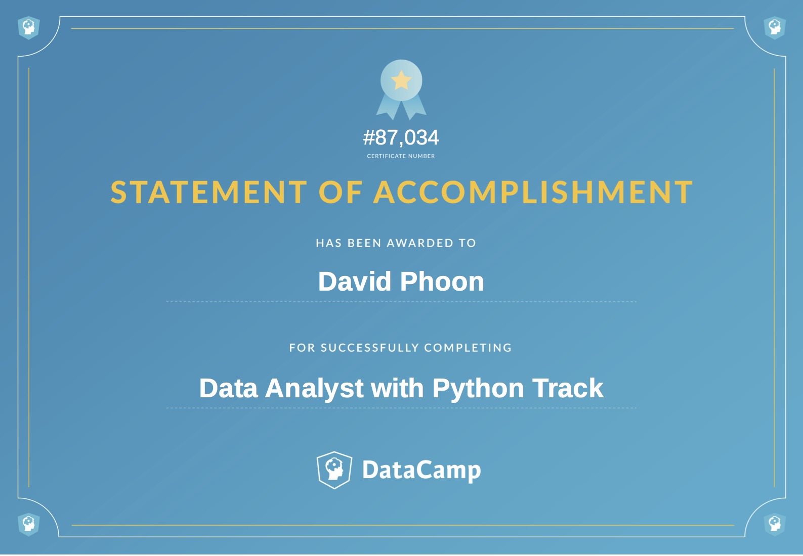

# Data Analyst with Python


>A Data Analyst uses data visualization and manipulation techniques to uncover insights and help organizations make better decisions.

Source:  [Datacamp](https://www.datacamp.com/tracks/data-analyst-with-python) [^1]

Credential ID 46c746160753e90ac58b6424f50ea6f910935195



---

[^1]: Certification hours and requisites correct as of 06-Feb-2020.
